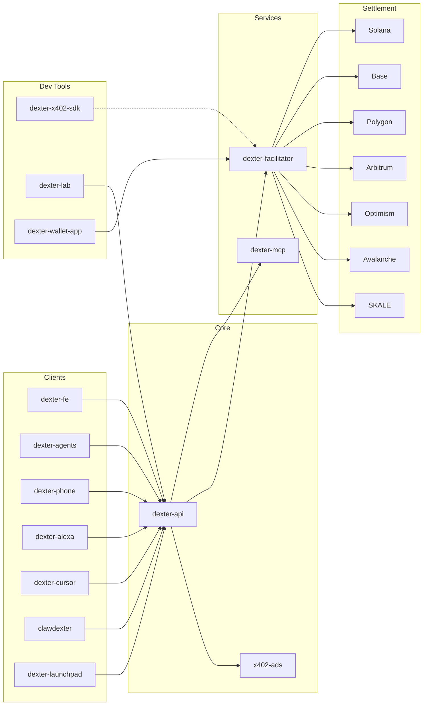

  

<h1 align="center">Organization</h1>

  <strong>Payments infrastructure for the agentic web. x402 protocol, AI marketplace, and multi-chain settlement.</strong>

  <a href="https://dexter.cash"><strong>dexter.cash</strong></a>&nbsp;&nbsp;|&nbsp;&nbsp;
  <a href="https://dexter.cash/opendexter"><strong>OpenDexter Marketplace</strong></a>&nbsp;&nbsp;|&nbsp;&nbsp;
  <a href="https://x402.org"><strong>x402 Protocol</strong></a>&nbsp;&nbsp;|&nbsp;&nbsp;
  <a href="https://lab.dexter.cash"><strong>Dexter Lab</strong></a>

---

## Architecture

> 🟢 Production&nbsp;&nbsp;&nbsp;&nbsp;🟡 In progress&nbsp;&nbsp;&nbsp;&nbsp;🔴 Not yet working

---

### Core Infrastructure

The backbone — API, frontend, payment settlement, tool server, and monetization engine.

| | Repo | Description |
|---|------|------------|
| 🟢 | [**dexter-api**](https://github.com/Dexter-DAO/dexter-api) | Central orchestrator — x402 billing, realtime sessions, MCP proxy, wallet management, marketplace engine |
| 🟢 | [**dexter-fe**](https://github.com/Dexter-DAO/dexter-fe) | Next.js frontend — marketplace, Lab, facilitator dashboard, voice/chat UI |
| 🟢 | [**dexter-facilitator**](https://github.com/Dexter-DAO/dexter-facilitator) | x402 v2 payment facilitator — verifies, settles, and sponsors transactions on Solana and EVM |
| 🟢 | [**dexter-mcp**](https://github.com/Dexter-DAO/dexter-mcp) | MCP server — both OpenDexter (unauthenticated) and Dexter MCP (authenticated) over HTTP and stdio. Also ships the [`@dexterai/opendexter`](https://www.npmjs.com/package/@dexterai/opendexter) npm package. |
| 🟢 | [**x402-ads**](https://github.com/Dexter-DAO/x402-ads) | Protocol-native sponsored resource recommendations — Dexter's monetization layer for the marketplace |

### Products

User-facing experiences with their own identity.

| | Repo | Description |
|---|------|------------|
| 🟢 | [**dexter-agents**](https://github.com/Dexter-DAO/dexter-agents) | **Dexter Voice** — flagship voice agent built on OpenAI Realtime API + MCP tools + x402 micropayments |
| 🟢 | [**dexter-lab**](https://github.com/Dexter-DAO/dexter-lab) | **Dexter Lab** — hosted API builder for anyone to create, deploy, and monetize paid endpoints. Colosseum Agent Hackathon 2026 entry. |
| 🟢 | [**dexter-cursor**](https://github.com/Dexter-DAO/dexter-cursor) | x402 plugin for Cursor IDE — search, pay, and build with x402. Submitted for Cursor review 3/3/26. |
| 🟢 | [**clawdexter**](https://github.com/Dexter-DAO/clawdexter) | [`@dexterai/clawdexter`](https://www.npmjs.com/package/@dexterai/clawdexter) — x402 marketplace plugin for OpenClaw agents |
| 🟡 | [**dexter-launchpad**](https://github.com/Dexter-DAO/dexter-launchpad) | **Dexter Launchpad** — launch autonomous AI agents with their own wallets, tokens, and revenue streams on Solana |
| 🔴 | [**dexter-wallet-app**](https://github.com/Dexter-DAO/dexter-wallet-app) | **Dexter Wallet** — consumer wallet (Backpack fork) with native x402 payment support. Unfinished. |

### SDKs & Packages

Libraries for developers building on x402.

| | Repo | Description |
|---|------|------------|
| 🟢 | [**dexter-x402-sdk**](https://github.com/Dexter-DAO/dexter-x402-sdk) | [`@dexterai/x402`](https://www.npmjs.com/package/@dexterai/x402) — chain-agnostic x402 v2 SDK for client, server, React hooks, and Express middleware |
| 🟡 | [**vendorsandbox**](https://github.com/Dexter-DAO/vendorsandbox) | Sandbox environment for testing x402 seller implementations |

### Agent Channels

Ways to reach Dexter from other platforms.

| | Repo | Description |
|---|------|------------|
| 🟡 | [**dexter-phone**](https://github.com/Dexter-DAO/dexter-phone) | Phone agent — Twilio Media Streams + OpenAI Realtime + MCP. Search is live; payments pending SMS campaign approval (ETA mid-March 2026). |
| 🟡 | [**dexter-lobster-skill**](https://github.com/Dexter-DAO/dexter-lobster-skill) | x402 marketplace skill for lobster.cash agents — pending further x402 txn handling work with Crossmint |
| 🔴 | [**dexter-alexa**](https://github.com/Dexter-DAO/dexter-alexa) | Alexa skill for voice-controlling Dexter through Amazon Echo. Needs overhaul before Skills Store submission. |

Additional private infrastructure and diagnostics tooling not listed.

---

### How it connects

**Users** visit [dexter.cash](https://dexter.cash) to browse the marketplace, build APIs in Lab, or talk to agents.

**Dexter MCP** (authenticated) gives logged-in agents managed wallets and automatic payment. **OpenDexter MCP** is the public, no-auth entry point — any agent pays directly via the [x402 protocol](https://x402.org), no Dexter account needed.

**Payments** settle on-chain through **dexter-facilitator** — USDC on Solana, Base, Polygon, Arbitrum, Optimism, Avalanche, and SKALE. The **dexter-x402-sdk** makes integration seamless for any developer.

**Sellers** deploy x402-gated endpoints and get auto-discovered in the [OpenDexter marketplace](https://dexter.cash/opendexter). A crawler indexes resources from external x402 facilitators (Coinbase, PayAI, Ultraviolet) every two hours, then AI-powered verification scores and categorizes each endpoint automatically.

---

  <a href="https://dexter.cash">dexter.cash</a>&nbsp;&nbsp;·&nbsp;&nbsp;
  <a href="https://x402.org">x402.org</a>&nbsp;&nbsp;·&nbsp;&nbsp;
  <a href="https://twitter.com/dexteraisol">@dexteraisol</a>&nbsp;&nbsp;·&nbsp;&nbsp;
  <a href="https://twitter.com/BranchM">@BranchM</a>&nbsp;&nbsp;·&nbsp;&nbsp;
  <a href="https://twitter.com/dexteraiagent">@dexteraiagent</a>

