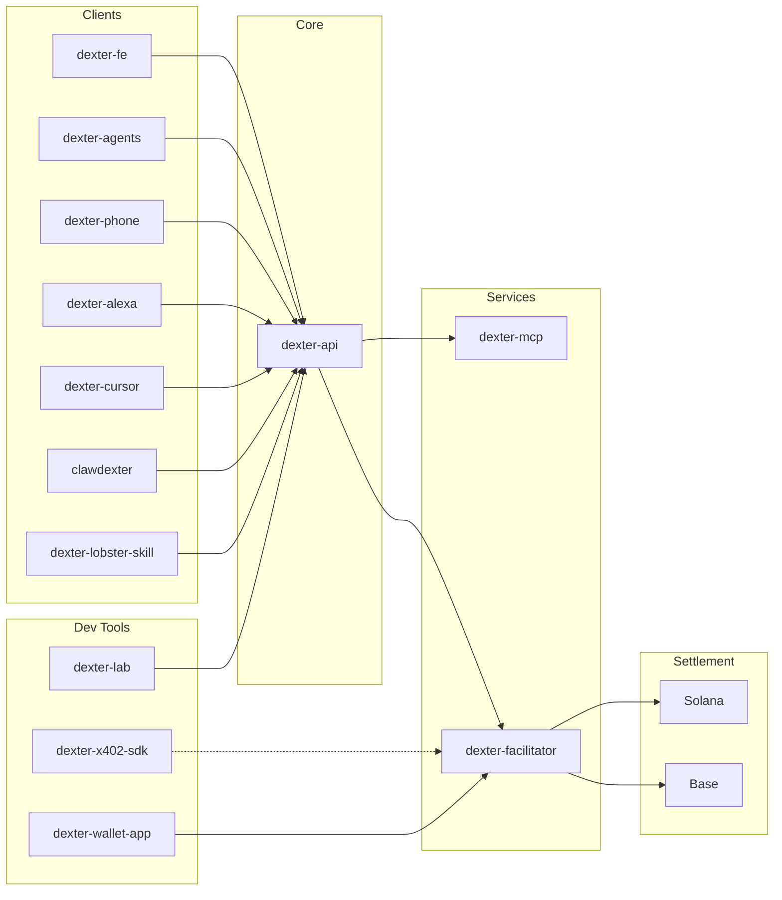

  

<h1 align="center">Organization</h1>

  <strong>Payments infrastructure for the agentic web. x402 protocol, AI marketplace, and multi-chain settlement.</strong>

  <a href="https://dexter.cash"><strong>dexter.cash</strong></a>&nbsp;&nbsp;|&nbsp;&nbsp;
  <a href="https://dexter.cash/opendexter"><strong>OpenDexter Marketplace</strong></a>&nbsp;&nbsp;|&nbsp;&nbsp;
  <a href="https://x402.org"><strong>x402 Protocol</strong></a>&nbsp;&nbsp;|&nbsp;&nbsp;
  <a href="https://lab.dexter.cash"><strong>Dexter Lab</strong></a>

---

## Ecosystem

---

### Core Platform

| Repo | Description | |
|------|------------|---|
| [**dexter-api**](https://github.com/Dexter-DAO/dexter-api) | Central orchestrator — x402 billing, realtime sessions, MCP proxy, wallet management, marketplace engine | `private` |
| [**dexter-fe**](https://github.com/Dexter-DAO/dexter-fe) | Next.js frontend — marketplace, Lab, facilitator dashboard, voice/chat UI | `private` |
| [**dexter-facilitator**](https://github.com/Dexter-DAO/dexter-facilitator) | x402 v2 payment facilitator — verifies, settles, and sponsors transactions on Solana and EVM | `private` |
| [**dexter-mcp**](https://github.com/Dexter-DAO/dexter-mcp) | MCP server exposing 60+ Solana DeFi tools over HTTP and stdio | `public` |

### Agent Surfaces

| Repo | Description | |
|------|------------|---|
| [**dexter-agents**](https://github.com/Dexter-DAO/dexter-agents) | Flagship voice agent — OpenAI Realtime API + MCP tools + x402 micropayments | `public` |
| [**dexter-phone**](https://github.com/Dexter-DAO/dexter-phone) | Phone agent — Twilio Media Streams + OpenAI Realtime + MCP | `private` |
| [**dexter-alexa**](https://github.com/Dexter-DAO/dexter-alexa) | Alexa skill — voice-control Dexter through Amazon Echo | `private` |
| [**dexter-cursor**](https://github.com/Dexter-DAO/dexter-cursor) | x402 plugin for Cursor IDE — search, pay, and build with x402 | `public` |

### Developer Tools

| Repo | Description | |
|------|------------|---|
| [**dexter-x402-sdk**](https://github.com/Dexter-DAO/dexter-x402-sdk) | Chain-agnostic x402 v2 SDK — client, server, React hooks, Express middleware | `public` |
| [**dexter-lab**](https://github.com/Dexter-DAO/dexter-lab) | Build, deploy, and monetize paid APIs from your browser | `public` |
| [**dexter-wallet-app**](https://github.com/Dexter-DAO/dexter-wallet-app) | Mobile wallet with native x402 payment support (Solana + EVM) | `private` |

### Integrations

| Repo | Description | |
|------|------------|---|
| [**clawdexter**](https://github.com/Dexter-DAO/clawdexter) | x402 payments + marketplace for OpenClaw agents — 59+ Solana DeFi tools | `public` |

---

### How it connects

**Users** visit [dexter.cash](https://dexter.cash) to browse the marketplace, build APIs in Lab, or talk to agents.

**Agents** (voice, phone, Alexa, Cursor, OpenClaw, lobster.cash) call tools through **dexter-mcp** and pay via **dexter-api**'s x402 billing.

**Payments** settle on-chain through **dexter-facilitator** — USDC on Solana or Base. The **dexter-x402-sdk** makes integration seamless for any developer.

**Sellers** deploy x402-gated endpoints and get auto-discovered in the [OpenDexter marketplace](https://dexter.cash/opendexter) (5,000+ indexed APIs).

---

  <a href="https://dexter.cash">dexter.cash</a>&nbsp;&nbsp;·&nbsp;&nbsp;
  <a href="https://x402.org">x402.org</a>&nbsp;&nbsp;·&nbsp;&nbsp;
  <a href="https://twitter.com/dabordexter">@dabordexter</a>

