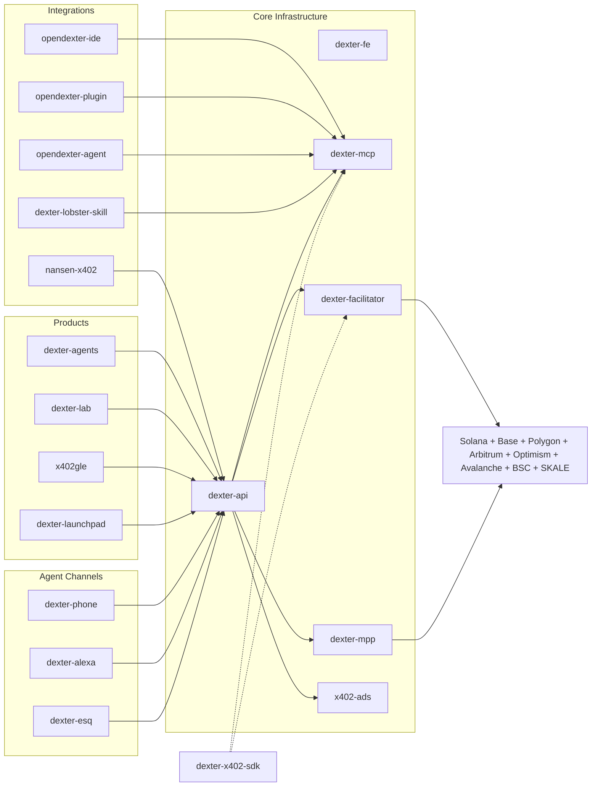

  

<h1 align="center">Organization</h1>

  <strong>Settlement, discovery, and monetization infrastructure for machine payments.</strong>

  <a href="https://dexter.cash"><strong>dexter.cash</strong></a>&nbsp;&nbsp;|&nbsp;&nbsp;
  <a href="https://dexter.cash/opendexter"><strong>OpenDexter</strong></a>&nbsp;&nbsp;|&nbsp;&nbsp;
  <a href="https://x402.org"><strong>x402 Protocol</strong></a>&nbsp;&nbsp;|&nbsp;&nbsp;
  <a href="https://x402gle.com"><strong>x402gle Explorer</strong></a>&nbsp;&nbsp;|&nbsp;&nbsp;
  <a href="https://lab.dexter.cash"><strong>Dexter Lab</strong></a>

---

## Architecture

```mermaid
flowchart LR
    subgraph integrations["Integrations"]
        ide["opendexter-ide"]
        odp["opendexter-plugin"]
        oda["opendexter-agent"]
        lobster["dexter-lobster-skill"]
        nansen["nansen-x402"]
    end

    subgraph products["Products"]
        agents["dexter-agents"]
        lab["dexter-lab"]
        explorer["x402gle"]
        launchpad["dexter-launchpad"]
    end

    subgraph core["Core Infrastructure"]
        api["dexter-api"]
        fe["dexter-fe"]
        mcp["dexter-mcp"]
        facilitator["dexter-facilitator"]
        mpp["dexter-mpp"]
        ads["x402-ads"]
    end

    subgraph channels["Agent Channels"]
        phone["dexter-phone"]
        alexa["dexter-alexa"]
        esq["dexter-esq"]
    end

    chains["Solana + Base + Polygon + Arbitrum + Optimism + Avalanche + BSC + SKALE"]

    ide --> mcp
    odp --> mcp
    oda --> mcp
    lobster --> mcp
    nansen --> api

    agents --> api
    lab --> api
    explorer --> api
    launchpad --> api

    phone --> api
    alexa --> api
    esq --> api

    api --> mcp
    api --> facilitator
    api --> mpp
    api --> ads

    facilitator --> chains
    mpp --> chains

    sdk["dexter-x402-sdk"] -.-> facilitator
    sdk -.-> mcp
```

> Status: &nbsp; :green_circle: Production &nbsp;&nbsp; :yellow_circle: In development &nbsp;&nbsp; :red_circle: Not yet working

---

### Core Infrastructure

The backbone — API, frontend, settlement, tool server, and monetization engine.

| | Repo | Description |
|---|------|------------|
| :green_circle: | [**dexter-api**](https://github.com/Dexter-DAO/dexter-api) | Central orchestrator — x402 billing, realtime sessions, MCP proxy, wallet management, marketplace engine, ecosystem indexing |
| :green_circle: | [**dexter-fe**](https://github.com/Dexter-DAO/dexter-fe) | Next.js frontend — marketplace, Lab, facilitator dashboard, voice/chat UI. Live at [dexter.cash](https://dexter.cash) |
| :green_circle: | [**dexter-facilitator**](https://github.com/Dexter-DAO/dexter-facilitator) | x402 v2 payment facilitator — verifies, settles, and sponsors transactions across Solana and 7 EVM chains. The only free facilitator in x402. |
| :green_circle: | [**dexter-mcp**](https://github.com/Dexter-DAO/dexter-mcp) | Dual MCP server — authenticated Dexter MCP (`mcp.dexter.cash`) and public OpenDexter (`open.dexter.cash`). Hosts [`@dexterai/x402-core`](https://www.npmjs.com/package/@dexterai/x402-core) shared types and search client. |
| :green_circle: | [**dexter-mpp**](https://github.com/Dexter-DAO/dexter-mpp) | [`@dexterai/mpp`](https://www.npmjs.com/package/@dexterai/mpp) — Managed Solana settlement for the Machine Payments Protocol. Zero gas for buyers, zero blockchain ops for sellers. |
| :green_circle: | [**x402-ads**](https://github.com/Dexter-DAO/x402-ads) | Protocol-native sponsored resource recommendations (Instinct). Ads injected into settlement responses. Publisher middleware, advertiser API, USDC payouts. |

### Products

User-facing experiences with their own identity.

| | Repo | Description |
|---|------|------------|
| :green_circle: | [**dexter-agents**](https://github.com/Dexter-DAO/dexter-agents) | **Dexter Voice** — flagship voice agent. OpenAI Realtime WebRTC + MCP tools + managed wallets + x402 micropayments. Live at [beta.dexter.cash](https://beta.dexter.cash) |
| :green_circle: | [**dexter-lab**](https://github.com/Dexter-DAO/dexter-lab) | **Dexter Lab** — AI-powered API builder. Describe an endpoint, Lab generates, deploys, verifies, and publishes it. Live at [lab.dexter.cash](https://lab.dexter.cash) |
| :green_circle: | [**x402gle**](https://github.com/Dexter-DAO/x402gle) | **x402gle** — x402 ecosystem explorer. Real-time indexing across 8 chains, facilitator leaderboards, resource quality scoring. Live at [x402gle.com](https://x402gle.com) |
| :yellow_circle: | [**dexter-launchpad**](https://github.com/Dexter-DAO/dexter-launchpad) | **Dexter Launchpad** — launch autonomous AI agents with their own wallets, tokens, and revenue streams on Solana |

### SDK

Libraries for developers building on x402.

| | Repo | Description |
|---|------|------------|
| :green_circle: | [**dexter-x402-sdk**](https://github.com/Dexter-DAO/dexter-x402-sdk) | [`@dexterai/x402`](https://www.npmjs.com/package/@dexterai/x402) — full-stack x402 v2 SDK. Client (`wrapFetch`), server (`x402Middleware`), React hooks, Express middleware, Access Pass, dynamic pricing, sponsored access. Multi-chain. |

### Integrations

OpenDexter across every AI development surface.

| | Repo | Description |
|---|------|------------|
| :green_circle: | [**opendexter-ide**](https://github.com/Dexter-DAO/opendexter-ide) | [`@dexterai/opendexter`](https://www.npmjs.com/package/@dexterai/opendexter) — x402 plugin + npm package. MCP server + 6 skills + scaffold commands. Installs into **Cursor**, **Claude Code**, **Codex**, and any MCP client. |
| :green_circle: | [**opendexter-plugin**](https://github.com/Dexter-DAO/opendexter-plugin) | [`@dexterai/opendexter-plugin`](https://www.npmjs.com/package/@dexterai/opendexter-plugin) — **OpenClaw** plugin. Search, price-check, and pay for x402 APIs. Replaces clawdexter. |
| :green_circle: | [**opendexter-agent**](https://github.com/Dexter-DAO/opendexter-agent) | **Pinata** agent template — deploy a fully configured x402-native agent in one click |
| :green_circle: | [**clawdexter**](https://github.com/Dexter-DAO/clawdexter) | [`@dexterai/clawdexter`](https://www.npmjs.com/package/@dexterai/clawdexter) — original OpenClaw plugin. Superseded by [opendexter-plugin](https://github.com/Dexter-DAO/opendexter-plugin). |
| :yellow_circle: | [**dexter-lobster-skill**](https://github.com/Dexter-DAO/dexter-lobster-skill) | x402 marketplace skill for **lobster.cash** agents — pending Crossmint x402 transaction handling |
| :green_circle: | [**nansen-x402**](https://github.com/Dexter-DAO/nansen-x402) | Autonomous wallet forensics agent — pays for its own intelligence via x402. Multi-hop tracing, entity resolution, D3 visualization. |

### Agent Channels

Platform-specific ways to reach Dexter.

| | Repo | Description |
|---|------|------------|
| :yellow_circle: | [**dexter-phone**](https://github.com/Dexter-DAO/dexter-phone) | Phone agent — Twilio Media Streams + OpenAI Realtime + MCP. Search works; paid calls pending US A2P 10DLC SMS compliance approval. |
| :yellow_circle: | [**dexter-esq**](https://github.com/Dexter-DAO/dexter-esq) | AI legal-channel assistant — openclaw agent for the Day One Law outside counsel engagement. Document retrieval, drafting, DocuSeal signing, email coordination. |
| :red_circle: | [**dexter-alexa**](https://github.com/Dexter-DAO/dexter-alexa) | Alexa skill for Amazon Echo. Needs overhaul before Skills Store submission. |

Additional private infrastructure and security tooling not listed.

---

### How it connects

**Settlement** is the foundation. Dexter is the only free facilitator in x402 — every payment settled through Dexter generates data about which APIs work, which agents need what, and where the money moves.

**Discovery** is built on that data. OpenDexter is a quality-verified catalog of every paid API in the ecosystem, accessible from Claude, ChatGPT, Cursor, OpenClaw, and any MCP client. Agents don't come to Dexter — Dexter is already inside the agent.

**Monetization** closes the loop. Instinct (x402-ads) injects sponsored recommendations into settlement responses. Sellers pay to reach the agents most likely to need their APIs. Every impression tied to a real on-chain transaction.

**Intelligence** packages everything. x402gle indexes the entire ecosystem in real-time — every facilitator, every resource, every chain.

The [`@dexterai/x402`](https://www.npmjs.com/package/@dexterai/x402) SDK makes the whole thing accessible to any developer in a few lines of code.

---

  <a href="https://dexter.cash">dexter.cash</a>&nbsp;&nbsp;&middot;&nbsp;&nbsp;
  <a href="https://x402.org">x402.org</a>&nbsp;&nbsp;&middot;&nbsp;&nbsp;
  <a href="https://x402gle.com">x402gle.com</a>&nbsp;&nbsp;&middot;&nbsp;&nbsp;
  <a href="https://twitter.com/dexteraisol">@dexteraisol</a>&nbsp;&nbsp;&middot;&nbsp;&nbsp;
  <a href="https://twitter.com/BranchM">@BranchM</a>

